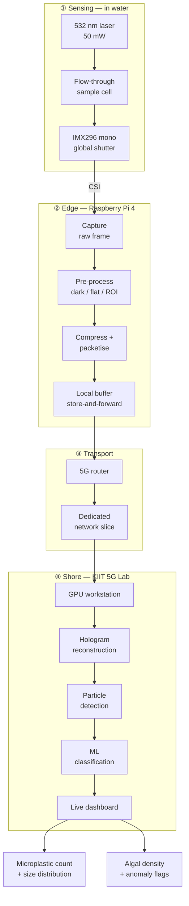

# HoloBuoy

**A solar-powered, 5G-connected digital holographic microscopy buoy that monitors coastal water at the particle level — and streams the holograms ashore for reconstruction and machine-learning classification.**

[](#project-status)
[](#license)
[](#hardware)
[](#how-it-works)

---

## The problem

Coastal water quality is still mostly measured the slow way: send a boat, fill a bottle, drive it to a lab, wait. What comes back are **bulk** numbers — pH, dissolved oxygen, turbidity. Those tell you the water is cloudy. They don't tell you *what* is in it.

That gap matters most for the things we now care about most:

| Target | Why bulk metrics miss it |
|---|---|
| **Microplastics** (~10–500 µm) | Invisible to turbidity; needs per-particle imaging to count and size |
| **Algal cells / bloom precursors** | Detectable days earlier from cell morphology and density than from a visible bloom |
| **Suspended sediment** | Shape and size distribution carry the signal, not total load |
| **Pathogens** *(long-term goal)* | Requires particle-level discrimination, not a single scalar |

HoloBuoy replaces the bottle with a microscope that stays in the water.

---

## How it works

HoloBuoy uses **inline digital holographic microscopy (DHM)**. Instead of photographing particles, it records the *interference pattern* formed when coherent laser light passes through a water sample.

```
   532 nm laser  ──▶  flow-through   ──▶  mono global-shutter  ──▶  hologram
   (50 mW)            sample cell         camera (IMX296)            (raw frame)
```

That interference pattern encodes the full optical field, not just intensity. A computer then **numerically back-propagates** it to recover what a normal camera throws away:

```
raw hologram ─▶ angular-spectrum propagation ─▶ complex field ─▶ amplitude + phase ─▶ 3D particle data
```

**Why this is the right instrument for a buoy:**

- **One exposure, full depth.** A single frame reconstructs the entire sample volume — no mechanical focus scanning, so no moving parts to seize up in seawater.
- **No reagents.** No staining, no consumables, no chemistry to resupply.
- **Phase is free.** Transparent particles that are near-invisible in brightfield show up clearly in the phase channel.

> **Sampling headroom.** The IMX296's 3.45 µm pixel pitch puts the Nyquist sampling floor at ~6.9 µm — comfortably below the 10 µm lower bound of the microplastic target range.

---

## System architecture



The buoy is deliberately **thin at the edge**: the Pi captures, conditions, compresses and buffers, but does not reconstruct. Back-propagation and inference run ashore on a GPU, which keeps the in-water power budget small enough to be solar-viable.

---

## Why 5G, specifically

Holograms are big, and they are big *in bursts*. This is a bandwidth profile that suits 5G rather than the low-rate IoT radios usually bolted onto buoys.

| Configuration | Frame | Raw size |
|---|---|---|
| Lab prototype — IMX296, 1456 × 1088 | 1.58 MP @ 10-bit packed | **≈ 2 MB** |
| Lab prototype — 16-bit unpacked | 1.58 MP @ 16-bit | **≈ 3.2 MB** |
| Field target — proposal camera | 12 MP @ 16-bit | **≈ 24 MB** |

Three 5G features are being exercised, not just "internet on a buoy":

- **Network slicing** — a dedicated, high-priority slice so holographic uplink is not starved by consumer traffic sharing the cell.
- **Power-saving / duty cycling** — the modem sits in a low-power state and the node wakes for roughly **1 minute in every 60**, capturing and transmitting in a burst.
- **Offshore network extension** — the buoy as a reachable node beyond the shoreline, which is what makes the relay and safety work in [Roadmap](#roadmap) possible later.

Estimated field power budget: **~25–30 W active, < 1 W standby** — the duty cycle is what makes solar operation feasible.

---

## Hardware

### Current lab prototype

| Component | Choice | Notes |
|---|---|---|
| Compute | Raspberry Pi 4B (4 GB) | Edge capture node |
| Camera | Waveshare IMX296 mono | 1456 × 1088, 3.45 µm, global shutter |
| Camera link | Raspberry Pi CSI | Ribbon, Pi sits beside the camera |
| Illumination | 532 nm, 50 mW green laser module | See wavelength note below |
| Sample cell | Acrylic flow-through | Between laser and sensor |
| Connectivity | ZTE F50 5G / Waveshare 5G CPE | Lab testbed |
| Processing | Remote GPU workstation | KIIT 5G Lab |

> [!IMPORTANT]
> **The reconstruction wavelength must match the laser actually installed.**
> The original proposal specifies a **520 nm** diode; the current bench uses a **532 nm** module. These are *not* interchangeable — back-propagation scales with λ, and using the wrong value produces plausible-looking but wrong reconstructions. Set it once in `config/optics.yaml` and never hard-code it.

### Field deployment (not yet built)

The field design is an **inverted-U frame** with the sample cell suspended between camera and laser, powered and fed from the surface buoy over PoE and DC — no batteries or active processing underwater. Flotation is HDPE foam and PVC.

---

## Repository structure

> Adjust to match your actual tree if it has drifted.

```
holobuoy/
├── buoy/                  # Raspberry Pi edge node
│   ├── capture/           # IMX296 control, frame acquisition, triggering
│   ├── preprocess/        # dark / flat-field correction, ROI crop
│   ├── compress/          # frame compression and packetisation
│   └── uplink/            # 5G transport, retry, local store-and-forward
├── station/               # Shore-side GPU workstation
│   ├── reconstruction/    # angular-spectrum back-propagation
│   ├── classify/          # particle detection + ML classification
│   └── api/               # service layer feeding the dashboard
├── dashboard/             # Live web dashboard
├── hardware/              # Optical bench, sample cell, enclosure notes
├── config/                # optics.yaml, capture.yaml, network.yaml
├── tools/                 # Calibration, synthetic holograms, bench tests
└── docs/                  # Proposal, architecture notes, calibration logs
```

---

## Quick start

**On the buoy node (Raspberry Pi 4, 64-bit Raspberry Pi OS):**

```bash
git clone https://github.com/<org>/holobuoy.git
cd holobuoy
python -m venv .venv && source .venv/bin/activate
pip install -r buoy/requirements.txt

# Confirm the camera enumerates before anything else
libcamera-hello --list-cameras

# Single test hologram
python -m buoy.capture --config config/capture.yaml --out data/test.tiff
```

**On the shore workstation:**

```bash
pip install -r station/requirements.txt

# Reconstruct a captured frame — wavelength comes from config, not the CLI
python -m station.reconstruction --input data/test.tiff --config config/optics.yaml

# Start the API + dashboard
python -m station.api & npm --prefix dashboard run dev
```

**Sanity check before trusting any result:** reconstruct a frame of a known target — a calibration reticle or a monodisperse bead suspension — and confirm the recovered sizes match. A wrong λ, pixel pitch or propagation distance all produce output that *looks* fine.

Reconstruction builds on the approaches in [HoloPy](https://holopy.readthedocs.io) and PyDHM.

---

## Project status

This repository is a **laboratory-verified proof of concept**. The table below is deliberately explicit about what exists, because several concepts discussed around this project are design intent rather than working code.

**Legend:** ✅ implemented · 🟡 partial / in progress · 📋 in proposal, not built · 🔭 future extension

| Capability | Status |
|---|---|
| Inline DHM optical bench (laser + cell + camera) | ✅ |
| Pi-side capture, pre-processing, compression | ✅ |
| 5G uplink to shore workstation | ✅ |
| Hologram reconstruction (angular spectrum) | ✅ |
| Particle detection and ML classification | 🟡 |
| Live dashboard | 🟡 |
| Network slicing on lab testbed | 🟡 |
| Validation against known microplastic concentrations | 🟡 |
| Solar power and charge management | 📋 |
| Underwater inverted-U frame, PoE camera | 📋 |
| 12 MP industrial camera | 📋 |
| Multi-buoy store-and-forward relay | 🔭 |
| Long-range point-to-point Wi-Fi between buoys | 🔭 |
| Satellite backhaul | 🔭 |
| Fisherman GPS safety beacon | 🔭 |
| SDR receive node on the buoy | 🔭 |

---

## Limitations — what HoloBuoy is not

Stated plainly, because the failure modes are as interesting as the features:

- **Not yet deployed.** Everything here is bench-verified on campus. No sea trial has been run, and biofouling, condensation and wave-induced vibration are all unaddressed.
- **Not a certified safety device.** The fisherman-beacon and SDR concepts in the roadmap are extensions under investigation. They are **not** a substitute for an EPIRB, DSC radio, or any certified distress system.
- **A 5G router is not a base station.** The buoy carries a 5G *client* modem. It does not provide cellular service to nearby vessels; that would require actual RAN/gNB hardware and core network support.
- **Marine VHF is regulated.** Any radio work on this project stays receive-only or inside licence-exempt bands. Transmitting on maritime distress or safety channels without authorisation is not something this project does.
- **Classification is only as good as its training set.** Distinguishing a microplastic fragment from a mineral grain of similar size and shape is genuinely hard, and current accuracy is bounded by the labelled data available.

---

## Roadmap

**Near term** — close out ML classification accuracy against known-concentration samples, harden the dashboard, complete network-slicing measurements on the lab testbed.

**Field phase** — solar and power management, underwater inverted-U frame, PoE camera, enclosure sealing, first sea trial.

**Platform extensions** *(exploratory, not committed)* — a multi-buoy chain in which only the innermost gateway carries cellular backhaul and outer buoys store-and-forward over long-range Wi-Fi; satellite backhaul beyond terrestrial coverage; and a receive-only SDR node letting the buoy relay position reports from licence-exempt fisherman safety beacons over the same network it already uses for holograms.

The organising idea behind all three: **the buoy is already a powered, networked, GPS-timed node in the water.** Extra capability is mostly marginal cost.

---

## License

Released under the [MIT License](LICENSE).

---

## Acknowledgements

Developed at **KIIT**, using the KIIT 5G Lab testbed for network slicing and uplink characterisation. Reconstruction approaches draw on the open-source DHM community, particularly HoloPy and PyDHM.
